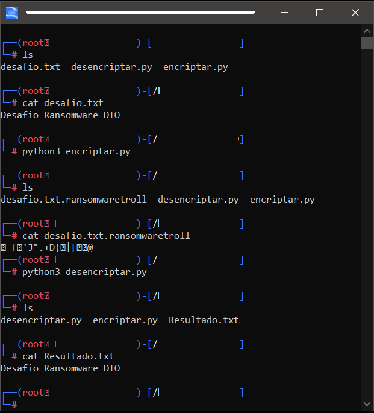

# Encriptação Ransomware
Desafio da DIO que consta em demonstra um encriptação de arquivo semelhante a de um Ransomware utilizando a linguagem Python. O código python utilizado foi desenvolvido/demonstrado/fornecido pelo instrutor durante o curso.


## Demonstração
- Arquivo vitima: ``` desafio.txt ```
- Script que criptografa: ``` encriptar.py ```
- Arquivo criptografado: ``` desafio.txt.ransomwaretroll ```
- Script que desencriptografa: ``` desencriptar.py ```
- Arquivo descriptografado: ``` Resultado.txt ```




- Confore visualizado na imagem , utilizamos o comando ``` ls ``` que nos mostra o arquivo vítima e os dois scripts em pyhton;
- Com o comando ``` cat ``` exibimos no terminal o conteúdo de ``` desafio.txt ```;
- Executamos o comando ``` python3 encriptar.py ``` para encriptar e renomear o arquivo;
- Mais uma vez executa-se o comando ``` cat ``` e notamos que a mensagem está impossível de ler;
- Executamos o comando ``` python3 desencriptar.py ``` para desencriptar e renomear o arquivo;
- Notamos que agora a mensagem pode ser lida novamente.

- Obs.: Também foi executado o comando ``` ls ``` para mostra a mudança de nome do arquivo em cada execução dos scripts.
